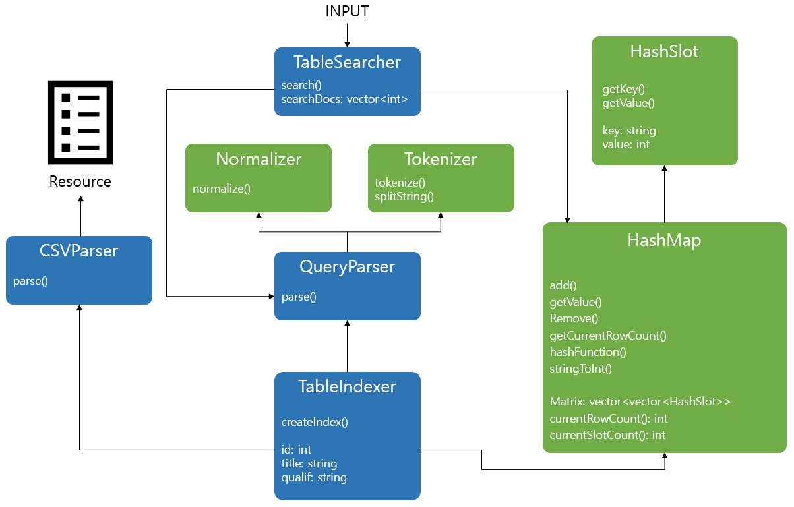
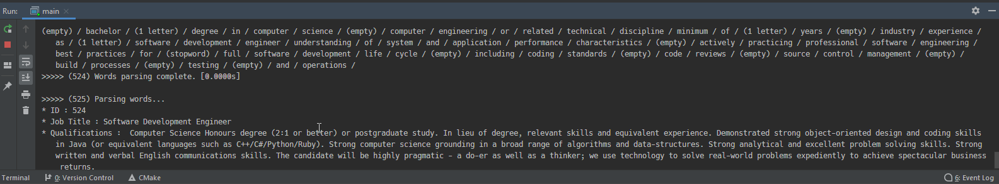

# Mini Search Engine (C++)


역색인 테이블 기반 검색 엔진 (C++)

### 개발 환경

* [JetBrains CLion](https://www.jetbrains.com/clion/?fromMenu)
* CMake 3.17.5

### 사용하기

```
cd mini-search-engine/
cmake .
cd output/
./mini-search-engine (Windows: .\mini-search-engine.exe)
```

약 10초 간의 인덱싱 작업(WSL Ubuntu 20.04 기준) 후 검색어 입력(ex: golang, hadoop, aws azure, spark, ...)

* 입력한 검색어를 포함하는 CSV 파일의 레코드 ID를 오름차순으로 출력
* 여러 단어로 된 검색어를 입력했을 경우, 공통 ID를 우선하여 출력

### 클래스 구조



### 사용 예시



### 참고 문서

* [검색과 색인, 그리고 강력한 지원군 루씬(Lucene)](https://blog.naver.com/tmondev/220323614797)
* [구글 검색 엔진의 해부학](http://www.emh.co.kr/content.pl?google_search_engine)
* [나는 왜 루씬을 C++로 재작성했는가?](https://deview.kr/data/deview/2019/presentation/[145]%EB%82%98%EB%8A%94%20%EC%99%9C%20%EB%A3%A8%EC%94%AC%EC%9D%84%20C++%EB%A1%9C%20%EC%9E%AC%EC%9E%91%EC%84%B1%ED%96%88%EB%8A%94%EA%B0%80.pdf)
